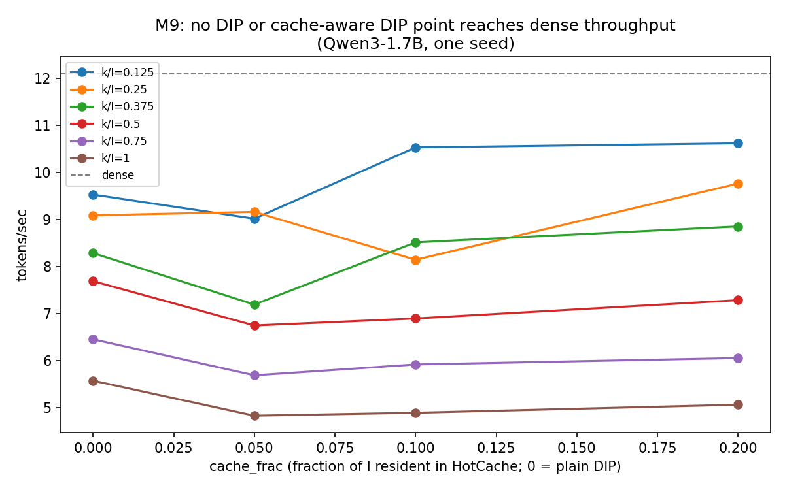

# Results

Every number below is backed by a checked-in CSV in `reports/`. No number goes
in here otherwise (PROJECT_SPEC.md sec 6/9).

## M0 -- Harness and baseline

Hardware: Google Colab, NVIDIA Tesla T4 (15360 MiB), driver 580.82.07, CUDA
13.0 (torch built against CUDA 12.8), SM clock locked to 1590 MHz via
`nvidia-smi -lgc`. Source: `reports/m0_pcie_bandwidth.csv`, `reports/m0_baseline.csv`.

**PCIe H2D bandwidth** (pinned vs pageable host memory, median of 100 runs
after 20 warmup, `bench/bench_pcie.py`):

| size | pageable | pinned |
|---|---|---|
| 1 MB | 3.2 GB/s | 11.2 GB/s |
| 16 MB | 6.5 GB/s | 12.2 GB/s |
| 256 MB | 6.7 GB/s | 12.3 GB/s |
| 1024 MB | 6.8 GB/s | **12.3 GB/s** |

Pinned memory plateaus around **12.3 GB/s** at large transfer sizes -- this is
the number M6+ offload streaming is judged against, not the PCIe Gen3 x16
spec-sheet figure (~15.75 GB/s theoretical). Pageable memory tops out at
~6.9 GB/s, well under half of pinned -- confirms pinning host buffers is not
optional for the offload path.

**Dev-model decode baseline** (Qwen3-1.7B, FP16, greedy, 128 new tokens,
`bench/bench_baseline.py`):

| variant | tokens/sec | peak VRAM |
|---|---|---|
| HF FP16 | 23.2 | 3.47 GB |
| HF FP16 + `torch.compile` | 22.6 | 3.47 GB |
| bitsandbytes INT8 | not run -- `bitsandbytes` not installed on this Colab image |

`torch.compile` did not help here (single-sample greedy decode, short
generation -- compilation overhead likely isn't amortized; not investigated
further, out of scope for M0). This FP16 number (~23 tok/s) is the baseline
soinfer's own kernels are compared against from M4 onward.

## M1 -- CUDA fundamentals

Same T4 session as M0 (clock locked to 1590 MHz). Source: `reports/m1_bandwidth.csv`,
`reports/m1_bandwidth.png`.

**Vector add** (`out = a + b`, achieved GB/s = 3*n*4 bytes / time):

| n (elements) | achieved GB/s |
|---|---|
| 262,144 | 167.0 |
| 1,048,576 | 213.1 |
| 4,194,304 | 244.1 |
| 16,777,216 | **254.9** |

Approaches but doesn't reach the 320 GB/s peak even at 16M elements -- launch
overhead and imperfect occupancy still cost a few percent at this size; the
larger-still sizes needed to fully amortize that were out of scope for a M1
warm-up kernel.

**Strided copy** (coalescing collapse; nominal GB/s = 2*n*4 bytes / time, n=2^18 fixed):

| stride | achieved GB/s |
|---|---|
| 1 | 114.5 |
| 2 | 113.8 |
| 4 | 71.8 |
| 8 | 46.5 |
| 16 | 26.3 |
| 32 | 24.4 |
| 64 | 22.6 |
| 128 | **19.4** |

Monotonic collapse as stride grows -- by stride 128 achieved bandwidth is
~6x lower than stride 1, for the exact same number of "useful" bytes moved.
(Absolute numbers here are lower than vector_add's because this sweep uses a
much smaller working set, 1-128 MB vs up to 64 MB x2; the collapse *shape*,
not the absolute GB/s, is the point of this kernel.)

**Sum reduction** (n=2^24, achieved GB/s = n*4 bytes read / time):

| variant | achieved GB/s |
|---|---|
| v1 naive atomic | 2.0 |
| v2 shared-memory tree | 92.0 |
| v3 warp-shuffle | 147.4 |
| v4 vectorized float4 + warp-shuffle | **273.1** |

v1-to-v2 is a **46x** jump (eliminating global-atomic contention by reducing
within a block first); v2-to-v3 is another 1.6x (avoiding shared-memory
traffic and `__syncthreads()` entirely inside a warp); v3-to-v4 is another
1.9x (4x fewer thread-instructions issued per byte, via `float4` loads).
v4 reaches within 15% of the 320 GB/s peak.

**Transpose** (n x n, achieved GB/s = 2*n^2*4 bytes / time):

| n | naive | tiled, unpadded | tiled, padded |
|---|---|---|---|
| 512 | 53.9 | 57.1 | 52.6 |
| 1024 | 91.0 | 154.6 | 177.0 |
| 2048 | 96.8 | 143.9 | **200.0** |
| 4096 | 79.1 | 177.0 | **201.8** |

At n=512 the three are within noise of each other (too few tiles to amortize
launch overhead). From n=1024 up, the pattern is consistent: naive (fully
uncoalesced writes) is slowest, tiling through shared memory roughly doubles
throughput by making both global reads and writes coalesced, and padding the
shared-memory tile by one column adds another consistent ~15-25% by removing
the 32-way bank conflict on the transposed read out of shared memory.

See `docs/LEARNING_NOTES.md` for the fuller explanation of each jump.

## M2 -- RMSNorm, online softmax, FP16 GEMV

Source: `reports/m2_gemv_bandwidth.csv`, `reports/m2_norm_softmax_splitk.csv`.

**FP16 GEMV** (achieved GB/s = (N*K*2 + N*2 + K*2) bytes / time; N=4096 fixed):

| K | v1 naive (1 thread/row) | v2 warp-shuffle | v3 + float4 vectorized loads |
|---|---|---|---|
| 1024 | 44.2 | 197.5 | 209.4 |
| 4096 | 46.3 | 225.4 | 260.1 |
| 16384 | 46.7 | 248.2 | **269.9** |

v1-to-v2 is a **~5x** jump (warp-shuffle reduction instead of one thread
doing the whole row serially); v2-to-v3 another ~10% (vectorized `float4`
loads, fewer instructions per byte) -- the same "parallelize the
reduction, then vectorize the loads" pattern M1's sum-reduction sweep
already showed, now on a real GEMV.

**Split-K GEMV** (K=1024, N=1048576 -- a deliberately K-starved shape where
one-thread/warp-per-row can't fill the GPU):

| variant | achieved GB/s |
|---|---|
| no split | 57.2 |
| split x4 | 185.7 |
| split x8 | **232.4** |
| split x16 | 229.1 |
| split x32 | 210.1 |

Splitting the K-dimension across more blocks (with an atomic accumulate at
the end) helps up to split x8, then degrades -- past that point,
atomic-contention overhead outweighs the added parallelism.

**RMSNorm / softmax** (K=4096, achieved GB/s = 2*rows*K*2 bytes / time):
rmsnorm 28.4 GB/s, softmax two-pass 28.2 GB/s, softmax online (single-pass)
28.2 GB/s -- all three memory-bound and essentially tied at this size, as
expected for simple elementwise-reduction kernels reading/writing one
K-length row.

## M3 -- Quantization library

Source: `reports/m3_perplexity.csv`, `reports/m3_quant_accuracy.csv` (pure
Python/PyTorch, no CUDA -- runs on any machine, including this project's own
no-GPU dev machine).

**Perplexity by format** (fp16 baseline: **18.52**):

| bits | per_tensor | per_channel | group128 | block32 | mx_e8m0 |
|---|---|---|---|---|---|
| 8 | 18.28 | 18.28 | 18.55 | 18.50 | 21.76 |
| 4 | 11,054,325 (collapsed) | 31.34 | 24.28 | 22.77 | 22.63 |

INT8 is close to lossless across every granularity except MX-E8M0 (power-of-2
scale quantization pays a real accuracy cost at 8 bits). **INT4 per-tensor
collapses completely** (perplexity in the millions -- garbage output) while
every GROUPED INT4 format (per-channel, group128, block32, mx_e8m0) stays in
a usable 22-31 range. This is the direct motivation for M4 onward using
grouped quantization exclusively, never per-tensor INT4.

**Why per-tensor INT4 collapses**: `frac_exact_zero` (fraction of
dequantized weights that round to exactly 0) is **99.6%** for per-tensor
INT4 vs. 43.8% for group128 and 21.5% for block32/mx_e8m0 -- a single
per-tensor scale, sized to the largest outlier magnitude in the WHOLE
tensor, collapses almost every normally-distributed weight to the zero bin
once outliers are present. Smaller groups isolate outliers to fewer
elements, so the rest of the tensor keeps a usable dynamic range.

## M4 -- Quantized GEMV kernels

Source: `reports/m4_gemv_throughput.csv`. Numerics done and verified;
performance target formally unmet (see below) but low-priority once M6's
roofline showed kernel speed isn't the system bottleneck.

**Achieved GB/s by format** (N=512 fixed):

| K | fp16 v3 (reference) | w8a16 | w4a16 naive | w4a16 lop3 |
|---|---|---|---|---|
| 1024 | 204.7 | 132.9 | 50.8 | 85.3 |
| 4096 | 256.1 | 201.9 | 65.2 | 119.8 |
| 8192 | 262.9 | 144.9 | 40.6 | **92.9** |

The lop3 (bit-pattern-construction dequant) kernel is consistently
**1.3-2.3x** faster than the naive (scalar shift/mask/sign-extend) INT4
dequant at every K -- worth the added kernel complexity. Neither INT4
variant reaches fp16's own bandwidth: dequantizing 4-bit packed weights to
fp16 on the fly costs real ALU time this project's own Nsight Compute
profile (M9, `reports/m9_ncu_summary.md`) later confirmed directly --
`gemv_w4a16_group_lop3` is genuinely compute-bound (72.2% SM throughput),
not memory-bound, so the INT4 packing's bandwidth *reduction* doesn't
fully translate to a matching speed *increase*. This is why M6's roofline
finding (every real weight matrix is transfer-bound, not compute-bound)
made this gap low-priority: the GEMV was never the bottleneck to begin
with.

## M5 -- Fused transformer kernels

No standalone benchmark CSV -- `rmsnorm`, `apply_rope`, `kv_cache_append`,
`decode_attention`, and `qk_norm` (which reuses the `rmsnorm` kernel
directly) are numerically verified by `test_m5_kernels.py`/`test_layer_parity.py`
and exercised on every real-model run from M6 onward (every row in every
table below actually calls all five of these every decode step). M9's
Nsight Compute profile (`reports/m9_ncu_summary.md`) is the first place
their individual occupancy/throughput characteristics are measured --
short version: none of them are register-limited, and their low achieved
occupancy (6-25%) is an inherent consequence of batch=1 decode (one
token's worth of work genuinely can't fill a 40-SM GPU), not a kernel
design problem.

## M6 -- Offload: streaming weights over PCIe

Source: `reports/m6_roofline.csv`/`.png`, `reports/m6_headline_generation.txt`,
`reports/m6_overlap_efficiency.json`.

**Every weight matrix transferred is transfer-bound, not compute-bound** --
the PCIe copy (10.7-11.2 GB/s at these sizes, pinned host memory) takes
**5.5x-10.2x longer** than the GEMV kernel that consumes the same bytes
once they land on the GPU. This is the central justification for M6's
whole design: overlapping compute with the NEXT weight's copy (double
buffering) matters far more than making the GEMV kernel itself faster --
directly explains why M4's INT4-vs-fp16 GEMV speed gap (above) turned out
not to matter for the system as a whole.

**Real Qwen3-14B generation**, INT4 streamed from a 6.61 GB pinned host
arena, peak VRAM 3.78 GB (vs. ~28GB for the full fp16 checkpoint):
1.11-1.27 tok/s, coherent text ("The capital of France is Paris...").

**Nsight Systems overlap evidence**: 93.99% overlap efficiency (achieved
9.88ms of overlap against an ideal of 10.51ms) -- but only 48.6% GPU-busy
overall (51.4% GPU-idle) at the wall-clock level. **This is the M6 finding
that mattered most**: the double-buffering mechanism itself overlaps
correctly (93.99% is close to ideal), but the system is CPU-dispatch-bound,
not transfer-bound -- there's real idle GPU time between kernel launches
that no amount of better overlap between copy and compute streams can
close. The same shape of finding recurs in M7 (DIP mechanism overhead) and
M9's Nsight Compute profile (batch=1 decode inherently underfills the
GPU) -- a consistent throughline, not three separate problems.

**A correction, found during M7**: `StreamManager`/`WeightPipeline`'s
double buffer had a real write-after-read race (no dependency enforced
"compute must finish reading a buffer before the next prefetch overwrites
it"), invisible on Qwen3-14B specifically (large per-weight GEMV time kept
the reader far ahead of the next writer by sheer timing luck -- the numbers
above are NOT invalidated by this) but produced non-deterministic greedy
decode on the smaller Qwen3-1.7B. Fixed; see
`docs/LEARNING_NOTES.md`'s M6/M7 entries and the durable lesson it taught
about what "verified on hardware" needs to say (verified AT WHAT SCALE).

## M7 -- Dynamic Input Pruning

Source: `reports/m7_pareto.csv`/`.png` (CORRECTED 2026-09-18, see below),
`reports/m7_gather_timing.csv`, `reports/m7_topk_timing.csv` (also corrected
2026-09-18).

**The accuracy-vs-bytes-saved curve, on real Qwen3-1.7B** (dense
perplexity: 16.50, teacher-forced over a 70-token passage):

| k/I | bytes/token saved | tokens/sec | perplexity | ratio vs. dense |
|---|---|---|---|---|
| 0.75 | 12.5% | 6.46 | 57.75 | 3.50x |
| 0.50 | 25.0% | 7.70 | 231.26 | 14.01x |
| 0.375 | 31.2% | 8.29 | 695.75 | 42.16x |
| 0.25 | 37.5% | 9.10 | 4,969.78 | 301.13x |
| 0.125 | 43.8% | 9.54 | 365,166.03 | 22,126.39x |

Perplexity degrades roughly log-linearly from k/I=0.75 down to 0.25, then
falls off a real cliff at k/I=0.125. **No point on this curve is a usable
operating point**: even k/I=0.75 costs 3.5x perplexity for 12.5% of bytes
saved, and k/I=0.5 (14x for 25%) is only the least-bad point that saves a
meaningful share of bytes. Every point is also slower than dense offload
(12.10 tok/s) -- see M8/M9 below for why. Below k/I=0.25 the
model is producing something closer to noise than degraded text. Honest
caveat, unchanged since first measured: ONE model (1.7B), ONE 70-token
passage, top-k-by-raw-gate-magnitude as the only selection criterion tried
-- not load-bearing for a stronger claim without a longer eval or the 14B
model.

**This table supersedes an earlier version of itself** -- the original
sweep was measured on a `topk_threshold_select` kernel with a real
non-determinism bug (same selected channel SET every call, but a different
internal ORDER, which fed into an order-sensitive float summation
downstream). Fixed 2026-09-18; the shape of the story survives (accuracy
degrades, then falls off a cliff) but the specific numbers do not -- the
old cliff was reported at k/I=0.25 with a 15,721x ratio; the corrected
number at that point is 301x, about 50x less catastrophic. See
`docs/LEARNING_NOTES.md`'s "M7 Pareto curve re-run with the fix" entry for
the full comparison.

**Row gather** (`gather_rows_staged` vs. naive per-row `cudaMemcpyAsync`,
I=17408): staged wins **3.03x-4.29x** across the k-sweep, growing wider as
k grows (more rows to batch into one H2D copy instead of many small ones).

**Top-k select timing, also corrected 2026-09-18**: `topk_threshold_select`
at I=17408, k/I=0.5 now measures **1446.1μs** median -- an honest ~8x
regression from the same determinism fix, on top of this kernel's
already-known single-block design (one of the T4's 40 SMs) limitation.
Trading real performance for a real correctness bug this project actually
hit is the right call, but the cost is now on the record precisely: this
kernel is ~144x over its original single-digit-microsecond target, up from
~18x before today. `docs/LEARNING_NOTES.md` has the full accounting and
the natural next step (a multi-block redesign that keeps the deterministic
ordering).

## M8 -- Cache-aware DIP

Source: `reports/m8_ablation.csv`, `reports/m8_channel_frequencies.csv`,
`reports/m9_ablation_matrix.csv`/`.png` (the fuller sweep, M9 task 2).

**Task 1 calibration** (real Qwen3-1.7B, dip_k=3072, k/I=0.5): selection
frequency is genuinely skewed, not uniform -- the top 25% most-selected
channels account for ~44-47% of all selections (vs. 25% under uniform
random selection).

**The ablation table** (dense -> +DIP -> +cache-aware DIP, k/I=0.5,
cache=10% of I, hot set chosen from a calibration pass on a SEPARATE
passage from the eval text -- realistic use, not the policy's best case),
reproduced bit-identical across independent runs:

| mode | bytes/token | bytes saved vs. dense | tok/s | perplexity | ppl ratio |
|---|---|---|---|---|---|
| dense | 704,643,072 | 0.0% | 12.08 | 16.504 | 1.000 |
| +DIP | 528,482,304 | 25.0% | 7.64 | 231.262 | 14.013 |
| +cache-aware DIP | 496,382,656 | 29.6% | 7.03-7.31 | 231.262 | 14.013 |

**Cache-aware DIP's perplexity is bit-identical to plain DIP's** (not just
close) -- direct hardware confirmation that caching changes only where
bytes come from, never the arithmetic. Throughput is a loss on both
counts: +DIP is 37% slower than dense, and adding the cache makes it
slower still (7.03-7.31 vs. 7.64 tok/s) despite moving fewer bytes. M9's
fuller sweep (below) shows the same pattern at every k/I >= 0.5.

Every real bug found verifying M8 (five of them, only one directly in the
"centerpiece" fused-GEMV numerics this milestone was most worried about) is
recorded in `docs/LEARNING_NOTES.md`'s 2026-09-18 entries.

## M9 -- Profiling, hardening, and the writeup

Source: `reports/m9_ncu_summary.md`/`.csv` (Nsight Compute), `reports/m9_ablation_matrix.csv`/`.png`.

**Nsight Compute, every hot kernel** (full results and one-sentence
analysis per kernel: `reports/m9_ncu_summary.md`). Headline finding: three
kernels -- `topk_threshold_select`, `gemv_w4a16_sparse_accumulate`, and
`gemv_dip_fused_down` -- account for **~96% of total captured kernel time**
in one full forward pass through all three decode variants; the large
dense GEMV kernels (`gemv_w4a16_group_lop3`, `gemv_dip_fused_up`) are
comparatively fast AND well-utilized (89-93% achieved occupancy, 72-76%
compute throughput). Second finding: **nothing profiled is
register-limited** -- theoretical occupancy is 100% for every kernel (max
43 registers/thread against a 255 budget) -- every achieved-occupancy
shortfall is launch configuration (batch=1 decode inherently underfills a
40-SM GPU) or memory access pattern, never register pressure.

**Ablation matrix** (lean scope: Qwen3-1.7B only, INT4 group-128, one seed
-- see `bench/bench_m9_ablation_matrix.py`'s docstring for the reasoning;
18 new (k/I, cache_frac) points on top of M7's 7 already-verified rows).
**No configuration reaches dense throughput** (12.10 tok/s; best DIP
point is 10.63 tok/s at k/I=0.125, where perplexity is 22,126x dense).
What the sweep shows:

- **The DIP mechanism itself is the dominant cost.** Plain DIP at k/I=1.0
  moves exactly as many bytes as dense but runs at 5.58 tok/s, so the
  selection/gather/accumulate path adds ~97 ms to an ~83 ms token before
  any pruning happens. This matches the Nsight finding above: three DIP
  kernels are ~96% of captured kernel time.
- **Turning the cache on has a fixed cost.** Going from plain DIP to a 5%
  cache lowers throughput at every k/I except 0.25 (e.g. 7.70 -> 6.75 at
  k/I=0.5). Larger caches recover some of it: at k/I=0.5, 6.75 -> 6.90 ->
  7.29 tok/s for 5% -> 10% -> 20% of I. At k/I >= 0.5 no cache size tested
  beats plain DIP; at k/I <= 0.375 the 10% and 20% caches do (e.g. 8.29 ->
  8.86 at k/I=0.375), but those points already cost 42x perplexity or more.
- **Throughput is single-seed and noisy.** The trend with cache size is not
  monotonic at k/I=0.25 (9.17 -> 8.15 -> 9.77), and repeated M8 runs of one
  configuration spread over 7.03-7.31 tok/s, so differences under ~0.5
  tok/s between nearby points aren't established.

Every cache-aware-DIP row's perplexity is bit-identical to the matching
plain-DIP row at the same k/I, across all 18 points -- extending M8's
single-point cache-correctness confirmation to the full matrix.

**Robustness**: reviewed `csrc/bindings.cpp` (90+ existing `TORCH_CHECK`s)
against PROJECT_SPEC.md's named concerns. Found and fixed the spec's own
named example -- every quantized-GEMV binding trusted `scale.size(1)` as
`num_groups` without cross-checking it against `ceil(K/group_size)`, so a
mismatched scale tensor caused a silent out-of-bounds read instead of a
loud failure. Fixed across 5 bindings with regression tests using a
genuinely ragged K/H. Arch guards: trivially satisfied (no kernel targets
anything but sm_75). See `docs/LEARNING_NOTES.md` for the one deliberate
non-fix (`topk_threshold_select`'s non-negative-input precondition,
intentionally not a runtime check -- would need a device sync on this
project's most latency-critical kernel).

**CI**: GitHub Actions runs the CPU-only test files
(`test_quant_roundtrip.py`, `test_hot_cache.py`) on every push --
`setup.py` now gracefully falls back to a pure-Python install when no
CUDA toolkit is present, instead of hard-failing the build. Every
GPU-requiring test file self-skips via its own existing
`pytest.mark.skipif`. Full CUDA kernel tests still need a real GPU runner
(Colab/Kaggle) -- `make build && make test` there, same as every session
of this project's own development.

**189/189 tests pass**, confirmed stable across repeated full-suite runs
throughout the session that produced all of M8 and M9's results above.
